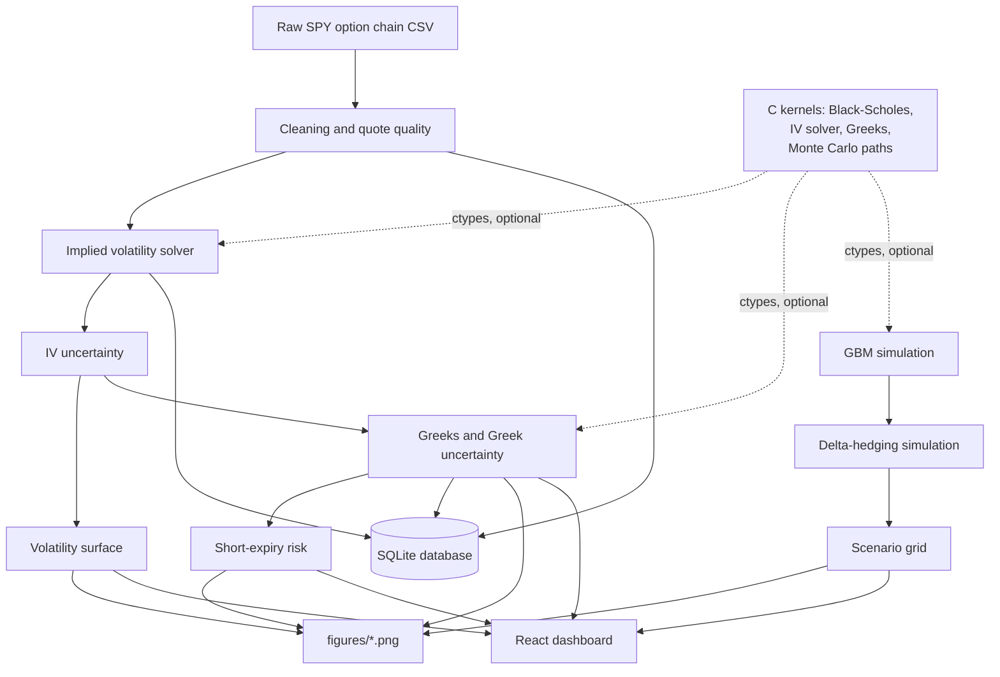

# Option Market Frictions & Hedging Error Lab


[](https://github.com/kedarvinayvanikar-boop/option-market-frictions-hedging-error-lab/actions/workflows/ci.yml)

A reproducible risk-measurement lab that quantifies how **bid-ask spreads, quote liquidity, short expiry, and transaction costs** distort implied volatility, option Greeks, and discrete delta-hedging performance for SPY options — built end to end in **Python, SQL, and C**, with an interactive React dashboard.

> This is an analytical project, not a trading strategy. It measures *measurement error and hedging error*, and makes no claim about mispriced options or future returns.

---

## Key results

**Quote quality.** Of 42 raw SPY contracts across three expiries, 37 (88%) pass the cleaning filters (zero bid, crossed market, missing bid/ask, spread > 40% of mid, zero liquidity). Retained spreads run 3–12% of the mid price and widen toward both wings.


**Implied-volatility uncertainty.** Every contract's IV is solved three times — from the bid, mid, and ask price — so the gap between the bid and ask smiles is a direct, model-based measure of IV uncertainty created by the spread.


**Greek uncertainty.** The same bid/ask gap propagates into Delta, Gamma, Vega, and Theta. Gamma uncertainty is largest for the nearest expiry and away from the money — exactly where short-dated traders need it most.


**Hedging error vs. cost.** A 20-scenario grid (5 hedge frequencies × 4 transaction-cost levels) shows that hedge *frequency* drives risk reduction far more than the transaction-cost assumption does — daily rebalancing has the lowest error variance at every cost level, while "no hedge" is an order of magnitude riskier than any hedged strategy.


**All 16 result figures, with captions and interpretation, are in [`reports/figures_gallery.md`](reports/figures_gallery.md).**

---

## Methodology

The analysis runs in ten sequential stages:

1. **Quote cleaning** — five filters (zero bid, crossed market, missing bid/ask, spread > 40% of mid, zero volume/open interest) are applied to the raw 42-contract snapshot. Each excluded contract and its reason are retained and reported.
2. **Implied volatility** — Black-Scholes IV is solved three times per contract (from bid, mid, and ask price) using a bracketing bisection root-finder, producing an IV interval rather than a single midpoint estimate.
3. **IV uncertainty** — the relative range (ask IV − bid IV) / mid IV is computed per contract and binned by moneyness and days-to-expiry to show where quote-driven uncertainty is largest.
4. **Volatility surface** — bid, mid, and ask surfaces are built from the three IV sets. A weighted reliability score (retention rate, IV completion rate, spread tightness, IV uncertainty) summarizes each expiry/option-type slice on a 0–1 scale.
5. **Greeks and Greek uncertainty** — Delta, Gamma, Vega (ν), Theta, and Rho are computed from Black-Scholes at each of the three IV inputs. The range across bid-IV, mid-IV, and ask-IV Greeks measures how much quote friction distorts each sensitivity.
6. **Short-expiry risk** — contracts are grouped into DTE buckets (8–14 days, 31–60 days) to compare how Gamma and Theta scale as expiry approaches, tracing the acceleration directly to the 1/√T factor in the Theta formula.
7. **GBM simulation** — 3,000 geometric Brownian motion price paths are generated (S₀ = K = 100, σ = 0.20, T = 30 days, daily steps) as a controlled environment where the true volatility is known by construction.
8. **Delta-hedging simulation** — a synthetic ATM call is delta-hedged across all 3,000 paths under five rules: no hedge, weekly, every 2 days, daily, and event-triggered (rebalance when |ΔDelta| > 0.05).
9. **Transaction-cost modeling** — rebalancing costs are applied at 0, 1, 5, and 10 basis points per trade, giving a 20-scenario grid.
10. **Scenario analysis** — mean error, standard deviation, mean absolute error, and tail percentiles are reported across all 20 scenarios to show the frequency-cost tradeoff.

---

## Conclusions

- **Spread variation is moneyness-driven, not expiry-driven.** Median bid-ask spread is nearly identical across all three expiries (~8.8%), but widens significantly toward both wings of the moneyness distribution, reaching 12%+ for the most out-of-the-money strikes.
- **Midpoint IV overstates precision.** The median IV relative range across retained contracts is 5.73%, meaning a single midpoint IV figure conceals a bid-to-ask volatility interval that is material for risk reporting and model validation.
- **Greek uncertainty is concentrated in near-dated, out-of-the-money contracts.** The maximum Delta uncertainty reaches 0.1172 and the maximum Theta uncertainty reaches 350.60, both in the June 2026 far-OTM put slice — the same region where Gamma is most sensitive to small price moves.
- **Theta accelerates nonlinearly as expiry approaches.** Median absolute Theta is 2.8× higher in the 8–14 DTE bucket than in the 31–60 DTE bucket for calls, consistent with the 1/√T scaling in the Black-Scholes Theta formula.
- **Hedge frequency dominates transaction cost as a risk driver.** Across the 20-scenario grid, moving from no hedge to daily rebalancing reduces error standard deviation from 4.45 to 0.46 — a 90% reduction. Increasing transaction costs from 0 to 10 bps shifts mean error by only ~0.10, a secondary effect by comparison.
- **Event-triggered hedging offers a practical middle ground.** With an average of ~9 rebalances per path versus ~31 for daily, event-triggered hedging achieves a mean absolute error of 0.439 at 0 bps versus 0.345 for daily — meaningfully tighter than weekly (0.735) at roughly a third of the trading cost of daily.

---

## Interactive dashboard

The dashboard turns the processed tables into four explorable views: an overview with surface reliability and sample simulated paths, a quote-quality breakdown, an IV-smile/Greeks explorer, and a hedge-scenario explorer where picking a hedge frequency and transaction-cost level updates the metrics, histogram, cost-risk frontier, and error heatmap live.


### Run it

```bash
cd dashboard
npm install
npm run dev       # opens a local dev server, default http://localhost:5173
```

For a static build:

```bash
npm run build      # writes dashboard/dist/
npm run preview    # serve the production build locally
```

A GitHub Actions workflow (`.github/workflows/pages.yml`) builds and deploys `dashboard/dist/` to GitHub Pages automatically on every push to `main`. Enable Pages under **Settings → Pages → Source: GitHub Actions** and the live dashboard will be available at:

**https://kedarvinayvanikar-boop.github.io/option-market-frictions-hedging-error-lab/**

To refresh the dashboard data after re-running the pipeline:

```bash
python3 build_dashboard_data.py
# copy the contents of data/processed/dashboard_data.json
# into the DATA constant at the top of dashboard/src/FrictionsLabDashboard.jsx
```

---

## Architecture



- **Python** (`src/`) owns data loading, cleaning, statistics, and orchestration — everything in `main.py`.
- **SQL** (`sql/`) defines the relational schema for snapshots, raw and cleaned quotes, IV results, and Greek results, with validation and reporting queries that run against the populated SQLite database.
- **C** (`c_src/`) provides faster Black-Scholes pricing, IV bisection, Greeks, and Monte Carlo path generation via `ctypes`. If a shared library isn't compiled, the affected functions fall back to the pure Python implementation automatically (`used_fallback=True`).
- **Dashboard** (`dashboard/`) is a Vite + React app that visualizes the pipeline's processed tables.

---

## Repository structure

```
.
├── main.py                    Single entry point: runs the full pipeline
├── build_dashboard_data.py    Aggregates results into dashboard_data.json
├── requirements.txt
│
├── src/                       Python modules (cleaning, IV, Greeks, surfaces,
│                               hedging, scenarios, database, plotting, ...)
├── c_src/                     C kernels + build_instructions.md
├── compiled/                  Shared libraries built from c_src/ (gitignored)
│
├── sql/                       schema.sql, validation_queries.sql, report_queries.sql
├── data/
│   ├── raw/                   Frozen option-chain snapshot + price history
│   ├── processed/             Every output table (CSV) + dashboard_data.json
│   └── database/              options_frictions_lab.db (SQLite)
│
├── notebooks/                 01–19, one notebook per analysis step
├── tests/                     pytest suite for src/ and the C bindings
├── figures/                   29 result figures (PNG)
├── reports/
│   └── figures_gallery.md     All 16 key figures with captions and interpretation
│
├── dashboard/                 Vite + React interactive dashboard
│   ├── src/FrictionsLabDashboard.jsx
│   └── screenshots/
│
└── .github/workflows/         CI (tests) and GitHub Pages deployment
```

---

## Getting started

```bash
python3 -m venv .venv
source .venv/bin/activate
pip install -r requirements.txt
```

### Compile the C kernels

```bash
mkdir -p compiled
gcc -shared -fPIC c_src/example_add.c -o compiled/libexample_add.so
gcc -O3 -fPIC -shared c_src/normal_math.c c_src/bs_pricer.c c_src/iv_solver.c c_src/greeks_kernel.c -o compiled/libbs_pricer.so -lm
gcc -O3 -fPIC -shared c_src/monte_carlo.c -o compiled/libmonte_carlo.so -lm
```

See `c_src/build_instructions.md` for macOS and Windows commands, and for the fallback behavior if a library isn't compiled.

### Run the full pipeline

```bash
python3 main.py
```

This regenerates every table in `data/processed/`, rebuilds `data/database/options_frictions_lab.db`, and rewrites all 29 figures in `figures/` — about a minute end to end. The ten stages are: clean quotes, build the database, solve IV (bid/mid/ask), compute IV uncertainty, build volatility surfaces, compute Greeks and Greek uncertainty, build the short-expiry risk tables, simulate GBM price paths, run a discrete delta-hedging simulation, and evaluate the hedge-frequency/transaction-cost scenario grid.

### Run the tests

```bash
pytest
```

54 tests cover the Python modules and the C bindings (with graceful fallback/skip if a shared library isn't compiled).

### Notebooks

`notebooks/01_...` through `notebooks/19_...` walk through the same steps as `main.py`, one concept at a time, with explanatory markdown and inline plots. Run them in numeric order from the project root.

---

## Limitations

- The option-chain snapshot is a single frozen point in time (2026-06-14), not a live feed.
- Black-Scholes assumes European exercise and constant volatility; many real equity options are American-style and exhibit volatility smiles.
- The hedging and scenario simulations use a separate synthetic at-the-money call (S = K = 100) under GBM rather than the live SPY chain, so that the true volatility used for hedging is known by construction.
- `surface_diagnostics`, `hedge_runs`, `hedge_results`, and `scenario_results` are defined in `sql/schema.sql` for a fully relational design but are currently produced as CSV outputs rather than loaded into the database.
