# Figure Gallery

Every figure below is regenerated by `python3 main.py` and written to
`figures/`. This gallery walks through the project's results in the same
order as the analysis: data quality, implied volatility, surfaces, Greeks,
short-expiry risk, and hedging.

## 1. Data quality

### Quote cleaning summary

Of 42 raw SPY contracts across three expiries, 37 (88%) survive the
quote-quality filters. The five exclusions are zero bid, crossed market,
missing bid/ask, a spread over 40% of the mid price, and zero volume/open
interest. Every later table in this project — IV, Greeks, surfaces, hedging —
is built only from the retained 37.

### Bid-ask spread by log-moneyness

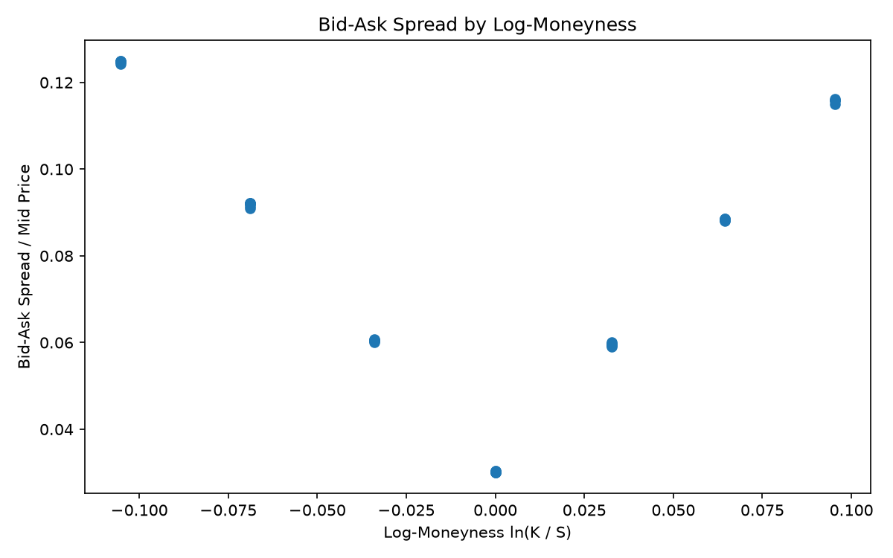

Spread as a share of the mid price is smallest near the money (around 3%)
and rises toward both wings, reaching 9-12% for the most in- and
out-of-the-money strikes. This is the core friction signal: a wider spread
means a wider band of "correct" prices, and that band feeds directly into
the implied-volatility step below.

### Bid-ask spread by expiry

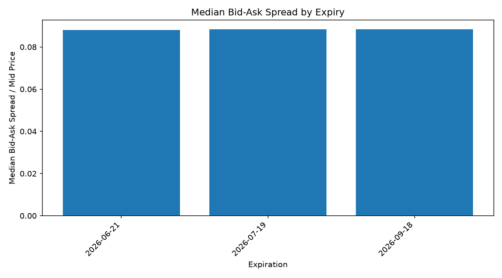

Spreads also vary by expiry. Near-dated contracts trade with less depth than
mid-dated ones, so their relative spreads tend to be wider — a second axis
along which quote quality degrades.

## 2. Implied volatility

### Solver failure heatmap

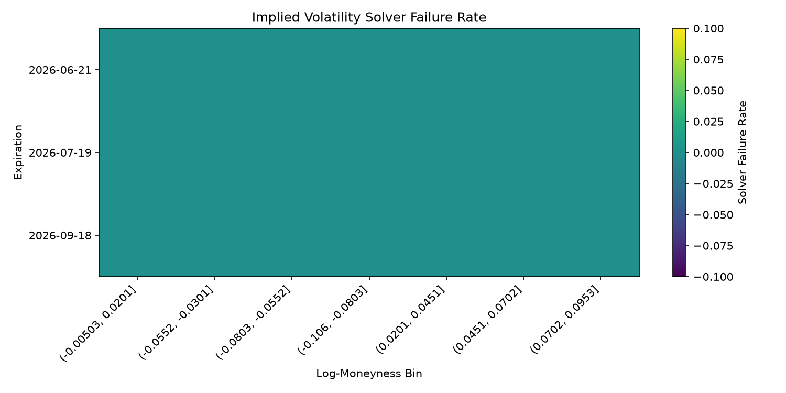

Every cell shows a 0% failure rate. The bisection-based implied-volatility
solver converged for all 111 bid/mid/ask solves across the 37 retained
contracts — a useful negative result that rules out solver failure as a
source of missing data in this snapshot.

### Bid/mid/ask IV smile

Solving IV separately from the bid, mid, and ask price produces three
smiles instead of one. The vertical gap between the bid and ask curves is
the implied-volatility uncertainty created purely by the bid-ask spread —
it widens toward the wings, mirroring the spread chart above.

### IV uncertainty heatmap

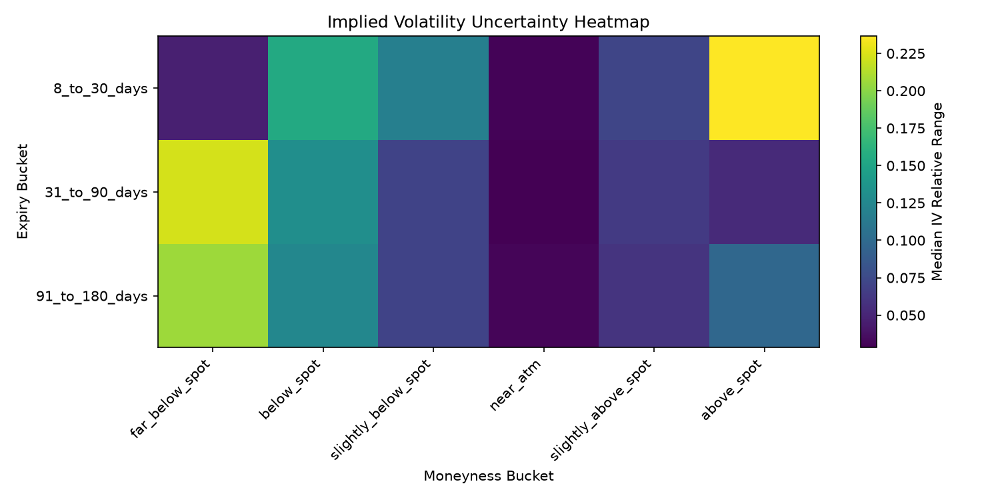

Binning that bid/ask IV gap by moneyness and days-to-expiry shows where
"the IV" is least trustworthy as a single number. Far-from-the-money,
longer-dated buckets carry the largest relative IV range, while near-ATM
buckets are tightest across all expiries.

## 3. Volatility surface

### Clean vs. raw surface

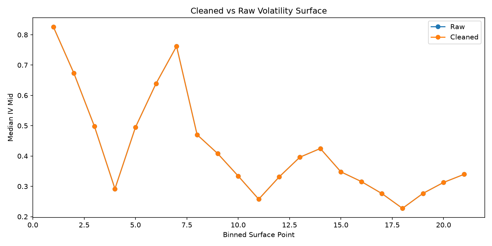

Comparing the mid-IV surface built from all 42 raw quotes against the
surface built from only the 37 retained quotes, the two lines are nearly
indistinguishable for this snapshot — the five excluded contracts don't
fall on grid points that materially shift the binned medians. That's a
useful check: quote-quality filtering removes individually bad quotes
without distorting the overall surface shape here.

### Surface reliability by expiry and option type

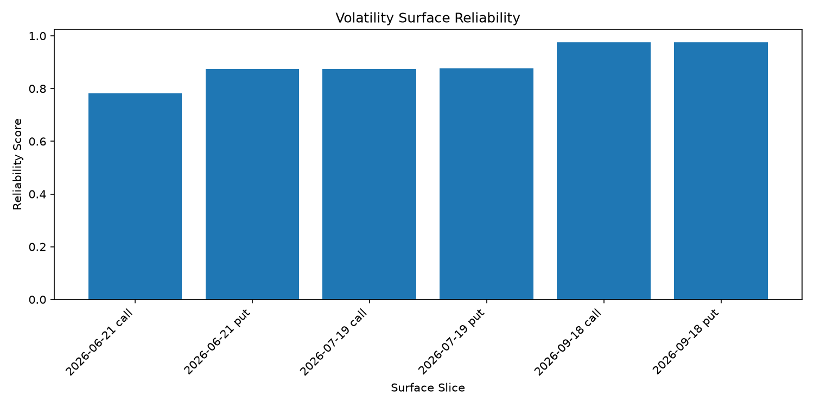

The reliability score combines retention rate, IV-completion rate, spread
tightness, and IV uncertainty into one 0-1 diagnostic per expiry/option-type
slice. The nearest expiry (2026-06-21 calls) scores lowest at 0.78; the
farthest expiry (2026-09-18) scores highest at about 0.97 — short-dated
quotes are the least reliable input to the surface.

## 4. Greeks and Greek uncertainty

### Gamma uncertainty heatmap

Gamma uncertainty (the range implied by bid vs. ask IV) is highest for the
nearest expiry, especially in the wings — consistent with Gamma's known
sensitivity to small volatility changes for short-dated contracts.

### Delta, Vega, and Theta uncertainty heatmaps

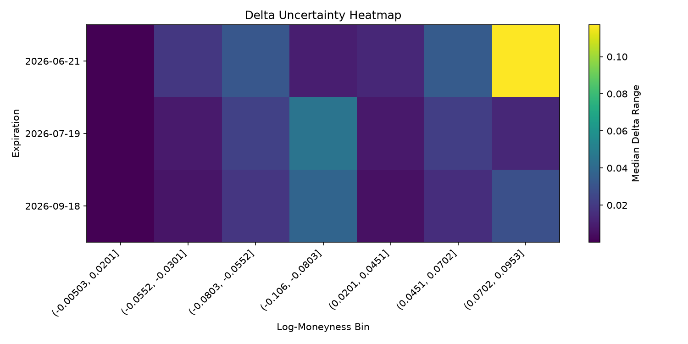
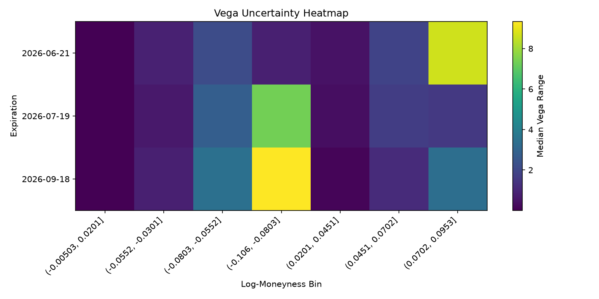
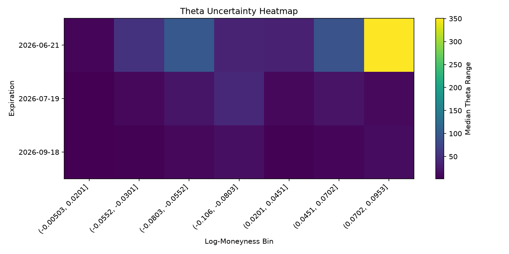

The same bid/ask-IV-driven uncertainty propagates through every Greek. Like
Gamma, Delta's uncertainty range is concentrated in the nearest expiry and
away from the money, though the specific peak strikes differ. Vega and
Theta uncertainty follow the same near-dated, away-from-the-money pattern
as IV uncertainty itself, since both Greeks scale directly with the level
of IV.

## 5. Short-expiry risk

### Gamma and Theta vs. days to expiry

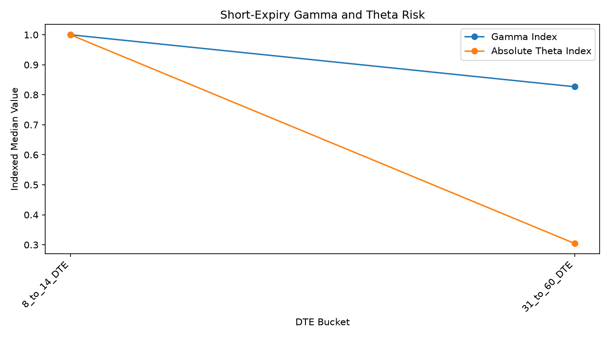

Indexing median Gamma and median |Theta| against the 8-14 day bucket and
comparing to the 31-60 day bucket shows |Theta| decaying much faster than
Gamma as expiry approaches — Theta drops to about 30% of its near-dated
value, while Gamma stays above 80%. Short-dated options carry disproportionate
time-decay risk relative to their directional Gamma exposure.

## 6. Hedging simulation

### Simulated price paths

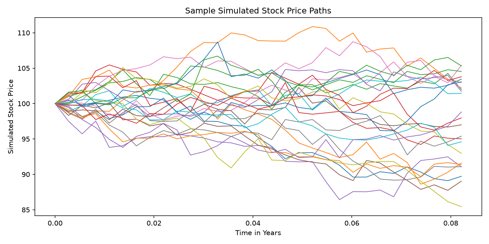

A sample of the 2,000 simulated geometric Brownian motion paths used to
drive the hedging study (S0 = 100, 30 days, daily steps). These paths are
shared across every hedge-frequency and transaction-cost scenario, so
differences in outcomes come only from the hedging rule, not the underlying
price process.

### Hedging error distribution

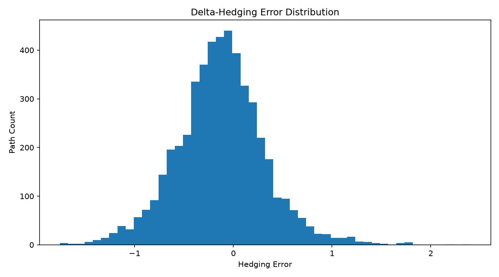

For the reference case — daily rebalancing at 5 bps — the hedging error
(terminal value of the option-plus-hedge portfolio) is centered close to
zero with a standard deviation under 0.5, but with a visible right tail:
discrete rebalancing under-hedges large up-moves more than it over-hedges
down-moves, a textbook Gamma effect.

### Hedge-frequency cost-risk frontier

Across the 20-scenario grid (5 hedge frequencies x 4 transaction-cost
levels), "no hedge" sits in its own region of the chart with both the
highest cost-risk and zero transaction cost (std. dev. ~4.45). Among hedged
strategies, daily rebalancing has the lowest error variance at every cost
level, but every strategy's transaction cost grows roughly linearly with
the assumed bps rate while its hedging-error variance stays nearly flat —
the frequency choice matters far more than the cost assumption for risk
reduction.

### Transaction cost and hedge-risk heatmap

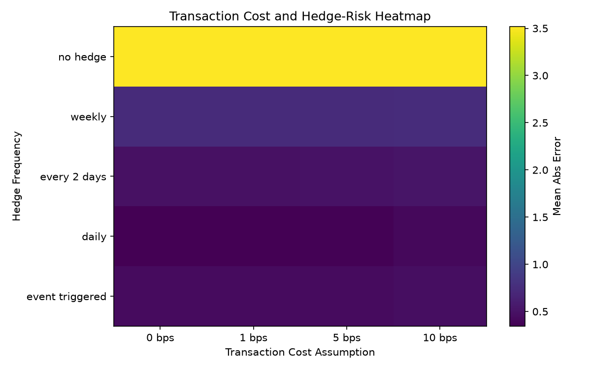

The same scenario grid as a heatmap of mean absolute hedging error. "No
hedge" is the clear outlier (bright cell, error ~3.5); every hedged
frequency clusters in a narrow band below 0.75, with daily rebalancing the
darkest (lowest-error) row at every cost level.
